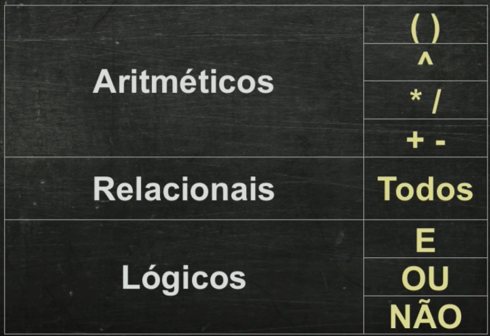

# Anotações

## Comandos

Escreva("Qualquer coisa") - Para Escrever no Visualg
Escreval - Para Escrever e Pular de Linha
Leia -  Aparece na tela o resultado marcado
var

## Identificadores

1 Deve Começar com uma  letra
2 Os próximos não podem ser letras ou números
3 Não pode utilizar nenhum símbolo, exceto_
4 Não pode conter espaços em branco 
5 Não pode conter letras com acentos
6 Não pode ser uma palavra reservada (palavras que são comandos) 
Exemplo  Nota1

## Operadores Aritméticos

## Tipos Primitivos

- Inteiro - Apenas Valores Inteiros sem parte fracionaria Exemplos 1,3-5,198,0
- Real Números Fracionários - 0.2 0.5  9.8 -77.3 3.1415
- Caractere - Palavras que Ficam Entre aspas podem conter numeros e acentos Exemplos: 
    - ("Tiago") ("açento") ("123")
- Logico - Verdadeiro ou Falso

## Ordem  de Precedência Matemática

3 + 2 / 2 = 4 – Sem o Parênteses Ele vai dividir 2/2 e depois somar 3
(3+2) /2 = 5 – Com parênteses a primeira a conta vai ser a de mais 3+2 e depois dividir por 5

## Funções Aritiméticas

## Operadores Lógicos

### Explicação operadores lógicos

Iremos ter o exemplo em que os casos em que o rosto feliz aparecer representa Verdadeiro.

## Ordem de Precedência Geral

